# Part 1. Getting Started

## 1. What is Amazon Web Services ?

### 1.1 What is cloud computing ?

- Cloud computing

  > NIST
  > Cloud computing is a model
  > for enabling ubiquitous, convenient, on-demand newwork access
  > to a shared pool of configurable computing resources( networks, virtual machines, storage, applications, and services)
  > that can be rapidly provisioned and released
  > with minimal management effort or service provider ineraction.

- types

  > Public  
  > Private  
  > Hybrid Cloud

- Services
  > IaaS (Infra. as a Service)  
  > PaaS (Platform as a Service)  
  > SaaS (Software as a Service)

### 1.2 What can you do with AWS ?

- some examples
  > * Hostuing a web shop (Fig 1-1)  
  > 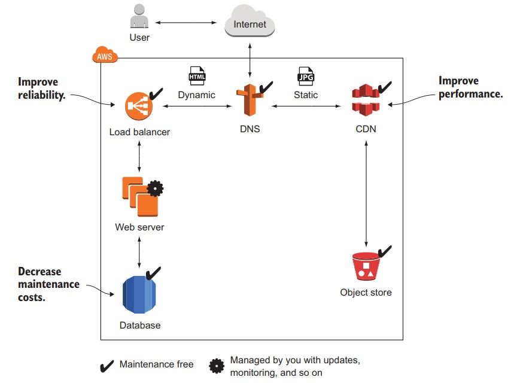  
  > 
  > * Running a J2EE application in private network (Fig 1-2)  
  > 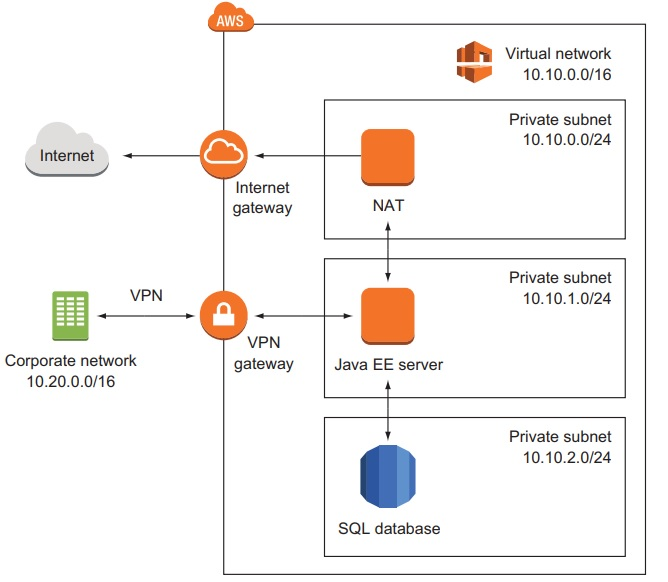   
  > 
  > * Implementing a highly available system( Fig 1-3)
  > 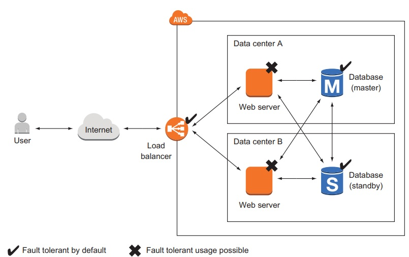  
  > 
  > * Profiting from low costs for batch processing infrastructure (Fig 1-4) 
  > 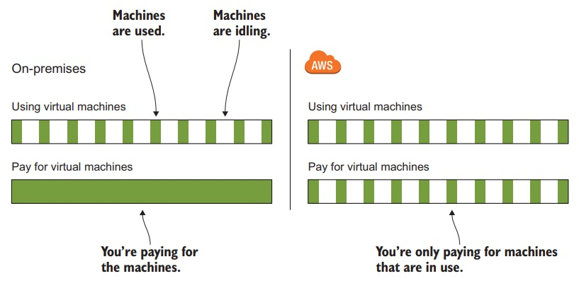  
  >
  > > price model (pay-per-use :: per-minute, spare capacity )

### 1.3 How you can benefit from using AWS ?

- some benefits

  > cost-saving  
  > Innovative and fast-growing platform
  
  > > https:// awa.amazon.com/about=aws/whats-new/
  >
  > Services solve common problems
  >
  > > examples) load balancing, queuing, sending email, storing files, ...
  >
  > Enabling automation
  > Scalability ( Flexible capacity )
  > Reliability ( Highly Available or Fault-Tolerant )
  > Reducing Time To Market
  > Economy of scale
  > Global Infrstructure
  > Professional partyner
  >
  > > ISO 27001 (security) / ISO 9001 (Quaility) / PCI DSS (Data Security)
  > > https://aws.amazon.com/compliance/

### 1.4 How much does it const ?

> http://aws.amazon.com/calculator ( AWS Simple Monthly Calculator : monthly cost of a planned setup)

  > 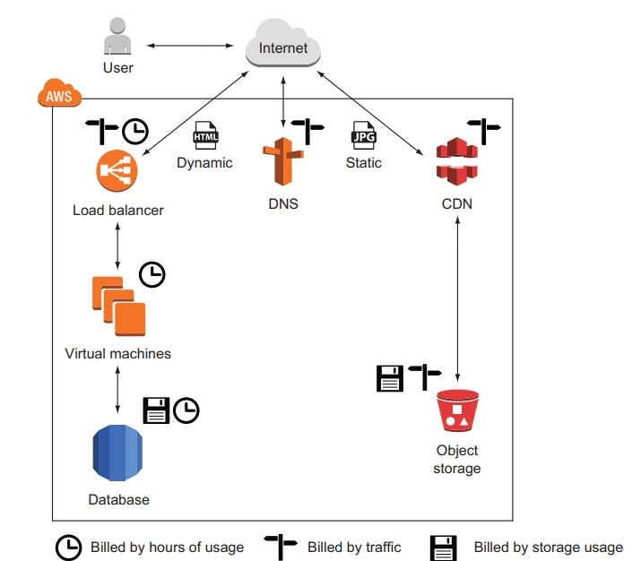  
  > 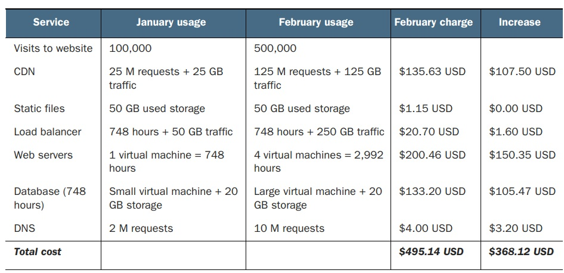  

- Free Tier http://aws.amazon.com/free

  > examples) 1-year-trial :: 750 hours virtual machine/ load balancer / 5G Object store / 20GB RDB

- Billing example

  > per-minutes(or hours)-of-usage :: Virtual machine( per-minute)/ Load-Balancer (per-hour)  
  > per-Traffic :: by # of GB or requests
  > per-stroage-usage :: by capacity or real usage

- Pay-per-use opportunities

### 1.5 Comparing alternatives

GCP( Google Cloud Platform), Microsoft Azure

- common features
  > world-wide infra
  > IaaS offering
  > Scalable-Distributed storage system
  > Pay-as-you-go pricing model

### 1.6 Exploring AWS services

> Fig 1-6, 1-7, 1-8  
> 
> 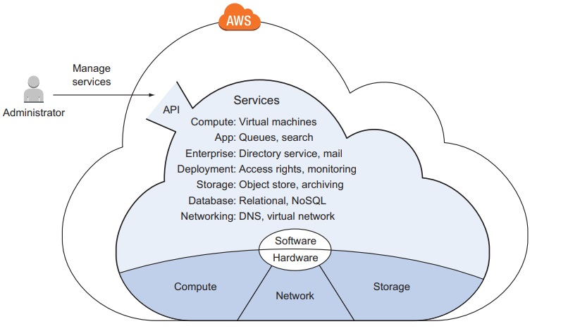   
> 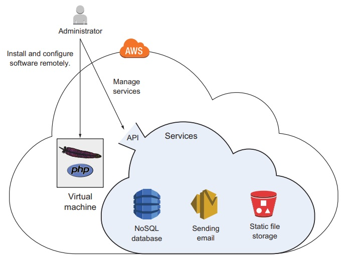  
> 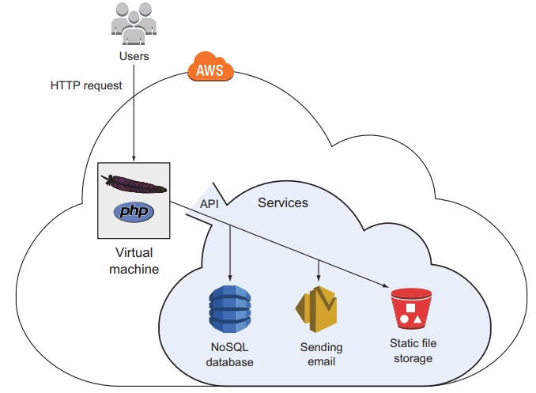  

- AWS Services

> service category (Fig 1-9)  
> 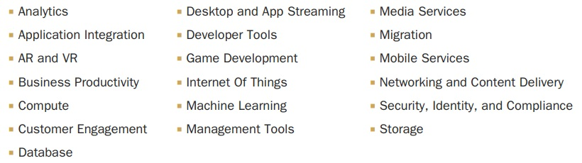    

- Services book covers
  > EC2 :: Virtual Machine  
  > ELB :: Load Balancer  
  > Lambda :: Executing Functions  
  > Beanstalk :: Deploying Web applications  
  > S3 :: Object Store  
  > EFS :: Network File-System  
  > Glacier :: Archiving data  
  > DynamoDB :: NoSQL DB  
  > ElastiCache :: In-Memory key-value store  
  > VPC :: Private Network  
  > CloudWatch :: Monitoring & Logging  
  > CloudFoundation :: Automating Infra.
  > OpsWorks :: Deploying Web applications  
  > IAM :: Restricting access to cloud resources
  > SQS :: Simple Queue Services ( Distributed Queue )

\*\* some missing :: CD (Continuous Delivery)/ Conatiner/ Big-Data

### 1.7 Interacting with AWS

> Fig 1-10  
> > 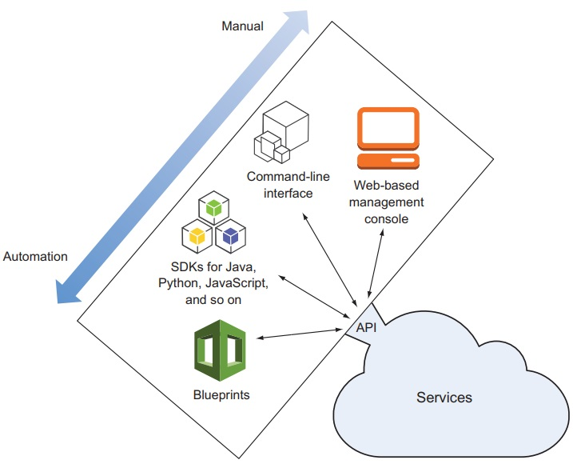    

- interacting
  > Management Console (Fig 1-11)
  > > 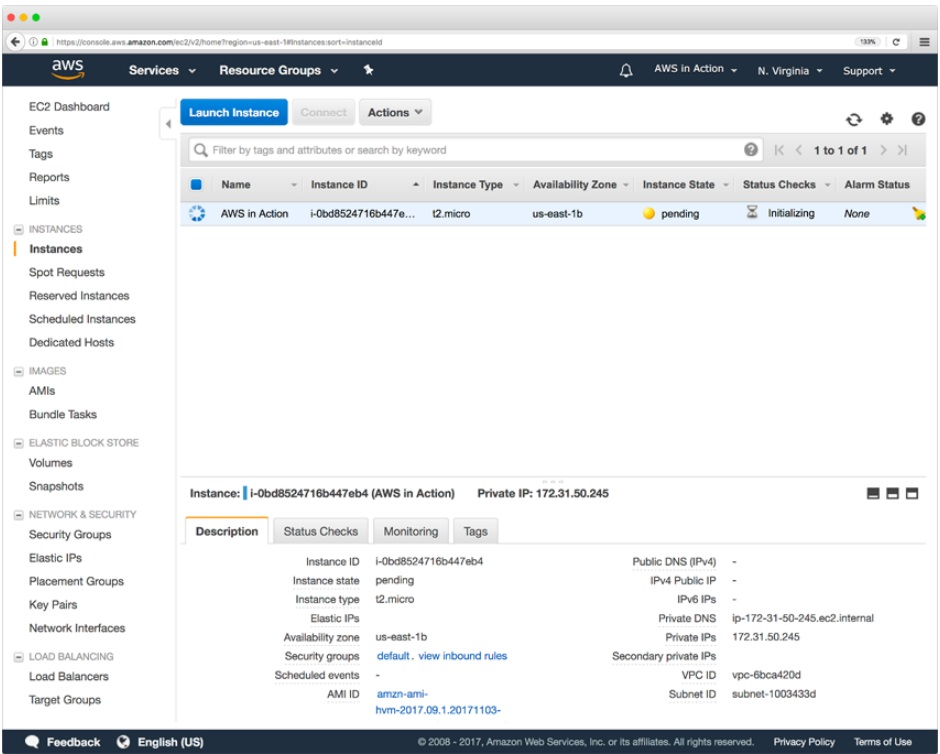    
  > CLI ( Fig 1-12 )
  > > 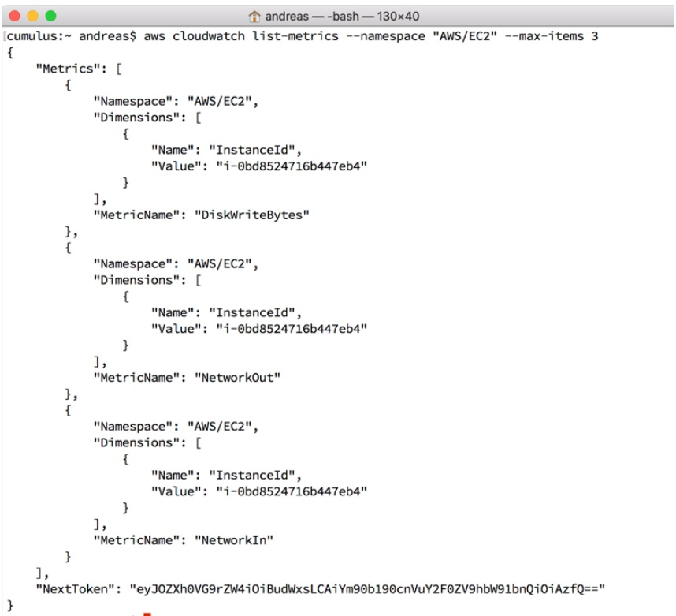    
  > SDKs
  > BludPrints( Fig 1-13)
  > > 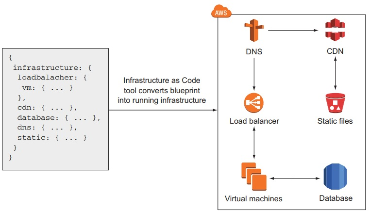    
  >
  > > BluePrint : description of system containing all resouces and dependencies.

### 1.8 Creating an AWS account

### 1.9 Create a billing alarm to keep track of you AWS bill

---

## 2. A simple example :: WordPress in five minues

> 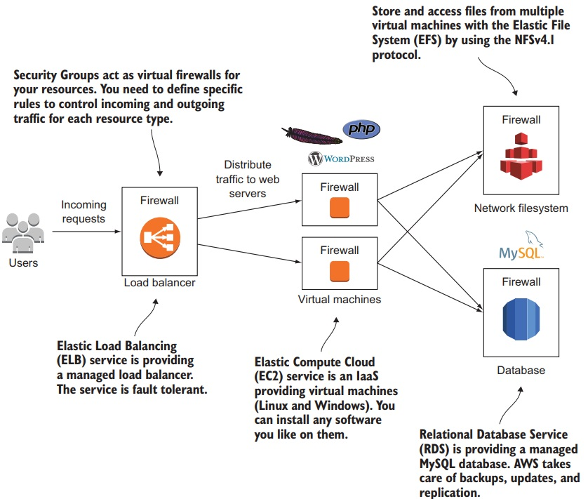  

### 2.1 Creating a infra.

### 2.2 Exploring infra.

### 2.3 Cost

### 2.4 Deleting infra.
